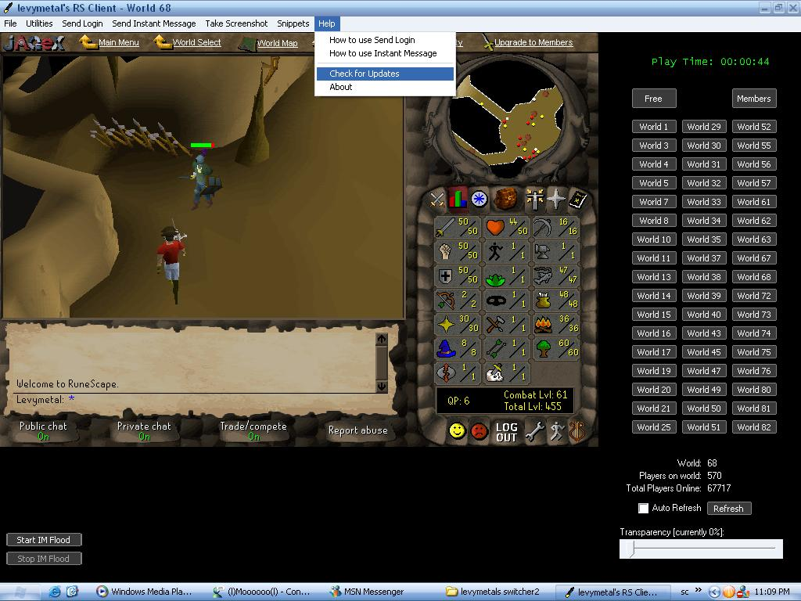

## Runescape Switcher Client

### Description

This is a Switcher Client (World Switcher, like SwiftSwitch) for Runescape. It is the first of its kind on this site, and has a few cool features like Sending login details to RS, sending an instant message to RS, taking screenshots, setting a default world for loading on startup, transparency (yay I did it! simple too, but may not work on slow computers I doubt it, CODE NOT BY ME!), remove adds for free servers, snippets, check for updates, custom buttons, and a few more less useful options too!
 
### More Info
 

             |
---                |---
**Submitted On**   |2005-07-05 19:55:32
**By**             |[Christian  V](https://github.com/Planet-Source-Code/PSCIndex/blob/master/ByAuthor/christian-v.md)
**Level**          |Intermediate
**User Rating**    |5.0 (10 globes from 2 users)
**Compatibility**  |VB 6\.0
**Category**       |[Games](https://github.com/Planet-Source-Code/PSCIndex/blob/master/ByCategory/games__1-38.md)
**World**          |[Visual Basic](https://github.com/Planet-Source-Code/PSCIndex/blob/master/ByWorld/visual-basic.md)
**Archive File**   |[Runescape\_1911597102005\.zip](https://github.com/Planet-Source-Code/christian-v-runescape-switcher-client__1-60972/archive/master.zip)

